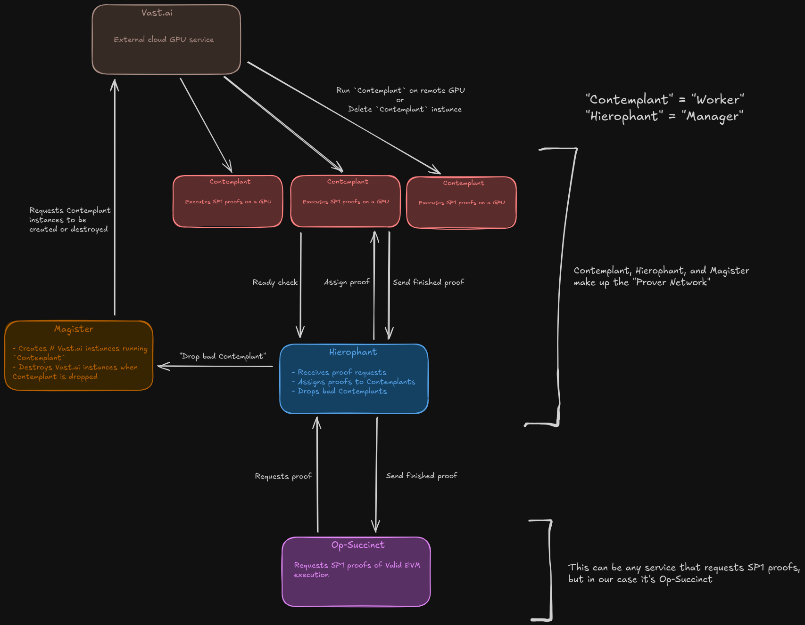

# Hierophant

Hierophant is an open-source SP1 prover network that is built to be a drop in replacement as a Succinct prover network endpoint.

[SP1](https://github.com/succinctlabs/sp1) is [Succinct's](https://www.succinct.xyz/) zero-knowledge virtual machine (zkVM).  Hierophant was built for direct compatibility for [op-succinct](https://github.com/succinctlabs/op-succinct/) but any program that utilizes Succinct's [sp1-sdk](https://crates.io/crates/sp1-sdk) rust crate to request proofs to the Succinct prover network can instead request proofs to a Hierophant instance.

In practice, running Hierophant with [Vast.ai](https://vast.ai/) GPU instances has been cheaper than Succinct's prover network.  See [Vast.ai integration (recommended)](#Vast.ai-integration-(recommended)).

## Table of Contents

- [Hierophant and Contemplant](#hierophant-and-contemplant)
- [Running Hierophant](#running-hierophant)
  - [Hierophant Endpoints](#hierophant-endpoints)
  - [Working with Multiple Hierophant Config Files](#working-with-multiple-hierophant-config-files)
- [Running Contemplant](#running-contemplant)
  - [Working with Multiple Contemplant Config Files](#working-with-multiple-contemplant-config-files)
  - [Vast.ai Integration (Recommended)](#vastai-integration-recommended)
- [Architecture](#architecture)
  - [State scheme](#state-scheme)
  - [Contemplant Overview](#contemplant-overview)
  - [Hierophant Overview](#hierophant-overview)
  - [Network-lib Overview](#network-lib-overview)
- [Building and Developing](#building-and-developing)
  - [Developing](#developing)
    - [Integration Test](#integration-test)
  - [Building](#building)
    - [Building Hierophant and Contemplant Docker images](#building-hierophant-and-contemplant-docker-images)
  - [contemplant_names.txt](#contemplant_namestxt)

## "Hierophant" and "Contemplant"

> "A hierophant is an interpreter of sacred mysteries and arcane principles."
[wikipedia](https://en.wikipedia.org/wiki/Hierophant)

> "Contemplant: One who contemplates."
[wikipedia](https://en.wiktionary.org/wiki/contemplant)

"Hierophant" and "Contemplant" are our versions of "coordinator" and "worker" or "master" and "slave".  The Hierophant receives proof requests and delegates them to be computed by the Contemplants.  "Contemplant" is used interchangeably with "worker" in this repo for brevity.

# Running Hierophant

Make a `hierophant.toml` and fill in config values:

```bash
cp hierophant/hierophant.example.toml hierophant/hierophant.toml
# Add your config values
RUST_LOG=info cargo run --release --bin hierophant
# Request proofs to http://<public-hierophant-ip>:<grpc-port>
```

Hierophant is an open source alternative to Succinct's prover network.  Hierophant is meant to be run with a program that requests Succinct sp1 proofs and takes a Succinct prover network rpc.  [`Op-Succinct`](https://github.com/succinctlabs/op-succinct/) is an example of a program that Hierophant works well for.  Anywhere that asks for a Succinct prover network rpc will be compatible with `http://<public-hierophant-ip>:<grpc-port>` (`9000` is the default grpc port).

Running the Hierophant by itself doesn't do anything.  Hierophant is the manager who receives proof requests and assigns proofs to be executed by Contemplants.  See [Running Contemplant](#running-contemplant) below.  There is always just 1 Hierophant for many Contemplants, and you must run at least 1 Contemplant to successfully execute proofs.  

Once at least 1 Contemplant is connected, there is nothing else to do besides request a proof to the Hierophant.  It will automatically route the proof and the Contemplant will start working on it and return it when it's done.  One note however is that the execution loop of Hierophant is driven on receiving proof status requests from the sp1-sdk library function call, so make sure to poll proof status's often.  Most likely you don't have to worry about this as `op-succinct` and other services that request sp1 proofs will poll for proof status updates often enough.

## Hierophant endpoints

Hierophant has a few endpoints for basic status checking available at the http port (default `9010`).

- `GET /contemplants` shows json information on all Contemplants connected to this Hierophant including ip, name, time alive, strikes, average proof completion time, current working proof, and progress on that proof.

example curl request run locally on Hierophant machine:

```bash
curl --request GET --url http://127.0.0.1:9010/contemplants
```

- `GET /dead-contemplants` shows json information on all Contemplants that have been dropped by this Hierophant.  Reasons for drop could be network disconnection, not making enough progress, or returning incorrect data.

example curl request run locally on Hierophant machine:

```bash
curl --request GET --url http://127.0.0.1:9010/dead-contemplants
```

- `GET /proof-history` shows json information on all the proofs that this Hierophant has completed including the Contemplant who was assigned to the proof and the proof time.

example curl request run locally on Hierophant machine:

```bash
curl --request GET --url http://127.0.0.1:9010/proof-history
```

## Working with multiple Hierophant config files

If you're running in an environment with multiple `hierophant.toml` configuration files (for example, running an integration test while debugging), you can specify the config file with `-- --config <config file name>`.

# Running Contemplant

It is *REQUIRED* that the Contemplant is run on a machine with a GPU.  This is because the Contemplant uses a GPU to accelerate proofs.  If you were only to use your CPU to execute a proof it will be 100-1000x slower than a GPU accelerated proof.

It is not recommended to manually run your Contemplant instances.  See [Vast.ai integration (recommended)](#Vast.ai-integration-(recommended)) section.

Make a `contemplant.toml` and fill in config values:

```bash
cp hierophant/contemplant.example.toml hierophant/contemplant.toml
# Add your config values
RUST_LOG=info cargo run --release --bin contemplant
# Your Contemplant will automatically start executing proof requests from the Hierophant
```

Each Contemplant is connected to 1 Hierophant.  You're likely running a Hierophant from the [Running Hierophant](#running-hierophant) section above.  Use your Hierophant's public ip in the `contemplant.toml` file for the `hierophant_ws_address` variable like `"ws://<public-hierophant-ip>:<hierophant-http-port>/ws"` (default Hierophant http port is `9010`).

The GPU proof accelerator is automatically run inside a Docker container.  
If you're running Contemplant inside a Docker container see [Building Hierophant and Contemplant Docker images](#building-hierophant-and-contemplant-docker-images) section.

## Working with multiple Contemplant config files

If you're running in an environment with multiple configurations (for example, running an integration test while debugging), you can specify the config file with `-- --config <config file name>`.

## Vast.ai integration (recommended)

If you don't have spare GPUs sitting around it is recommended to use Vast.ai to automatically manage your Contemplants.  Check out our [Magister](https://github.com/unattended-backpack/magister) repo for automatic allocation & deallocation of Vast.ai Contemplant instances.

# Architecture

Prover network architecture when running with Magister (See [Vast.ai integration (recommended)](#vastai-integration-(recommended))).


## state scheme

Most of the state is handled in a non-blocking actor pattern.  1 thread holds state and others interact with state by sending messages to that thread.
Any module in this repo that contain files `client.rs` and `command.rs` is following this pattern.  These modules are `contemplant/proof_store`, `hierophant/artifact_store`, and `hierophant/worker_registry`.
The flow of control for these modules are `Client method → Command → Handler → State update/read`.  To add a new state-touching function, I recommend first adding a new command to the enum in the appropriate `command.rs` file and letting the rust compiler guide you through the rest of the implementation.  In the future I'd like to move to a more robust actor library like Actix or Ractor.

## `contemplant` overview

```bash
src/
├── api/
│   ├── connect_to_hierophant.rs       # WebSocket initialization with Hierophant
│   ├── http.rs                        # HTTP handlers
│   └── mod.rs
│
├── proof_executor/
│   ├── assessor.rs                    # Proof execution estimation assessment 
│   ├── executor.rs                    # Proof execution
│   └── mod.rs
│
├── proof_store/
│   ├── client.rs                      # Public proof store interface
│   ├── command.rs                     # ProofStore access commands
│   ├── mod.rs
│   └── store.rs                       # Local proof status storage
│
├── config.rs                          # Configuration 
├── main.rs                            # Entry point
├── message_handler.rs                 # Handles messages from Hierophant
└── worker_state.rs                    # Global Contemplant state
```

## `hierophant` overview

```bash
src/
├── api/
│   ├── grpc/
│   │   ├── create_artifact_service.rs     # ArtifactStore service handlers
│   │   ├── mod.rs
│   │   └── prover_network_service.rs      # ProverNetwork service handlers
│   │
│   ├── http.rs                            # HTTP handlers
│   ├── mod.rs
│   └── websocket.rs                       # WebSocket handlers
│
├── artifact_store/
│   ├── artifact_uri.rs                    # Artifact id struct
│   ├── client.rs                          # Public artifact store interface 
│   ├── command.rs                         # ArtifactStore access commands
│   ├── mod.rs
│   └── store.rs                           # Artifact reading & writing
│
├── proof/
│   ├── completed_proof_info.rs            # A proof struct
│   ├── mod.rs
│   ├── router.rs                          # Interface for assigning and retrieving proofs
│   └── status.rs                          # ProofStatus struct
│
├── worker_registry/
│   ├── client.rs                          # Public worker registry interface
│   ├── command.rs                         # WorkerRegistry access commands
│   ├── mod.rs
│   ├── registry.rs                        # Managing and communicating with Contemplants
│   └── worker_state.rs                    # WorkerState struct
│
├── config.rs                              # Hierophant configuration
├── hierophant_state.rs                    # Global Hierophant state
└── main.rs

proto/
├── artifact.proto                         # Protobuf definitions for ArtifactStore service
└── network.proto                          # Protobuf definitions for ProverNetwork service
```

## `network-lib` overview

This is a library for types shared between both `hierophant` and `contemplant`.

```bash
src/
├── lib.rs                 # Shared structs
├── messages.rs            # Shared message types 
└── protocol.rs            # Shared protocol constants
```

# Building and developing

## Developing

When making a breaking change in Hierophant/Contemplant compatability, increment
the `CONTEMPLANT_VERSION` var in `network-lib/src/lib.rs`.  On each Contemplant
connection, the Hierophant asserts that the `CONTEMPLANT_VERSION` that they have
is the same as the `CONTEMPLANT_VERSION` being passed in by the Contemplant.

If file structure is changed, kindly update the tree in the [Architecture](#architecture) section for readability.

When a new release of SP1 comes out extract the new `moongate-server` binary from Succict's CUDA prover docker image and add it to `docker/moongate-server`.  This is Succinct's closed source CUDA proof accelerator.  The current `docker/moongate-server` was extracted from the image `https://public.ecr.aws/succinct-labs/moongate:v5.0.0`.

### Integration test

The integration test is a basic configuration that only tests minimal compatibility.  It runs a Hierophant with 1 Contemplant and requests a single small proof.

```bash
RUST_LOG=info cargo run --release --bin integration-test
```

## Building

Install `protoc`: [https://protobuf.dev/installation/](https://protobuf.dev/installation/)

`cargo build --release`

### Building Hierophant and Contemplant Docker images

Before building a docker image make sure to build the binary:

```bash
cargo build --release --bin hierophant
# If Contemplant is run inside Docker without this feature it will crash
cargo build --release --bin contemplant --features enable-native-gnark
```

Then build the image:

```bash
docker build -f docker/Dockerfile.hierophant -t hierophant .
docker build -f docker/Dockerfile.contemplant -t contemplant .
```

Add your ssh keys to `docker/authorized_keys` if you want ssh access inside Contemplant.

## `contemplant_names.txt`

List of biblical names to randomly draw from if a Contemplant is started without a name.
